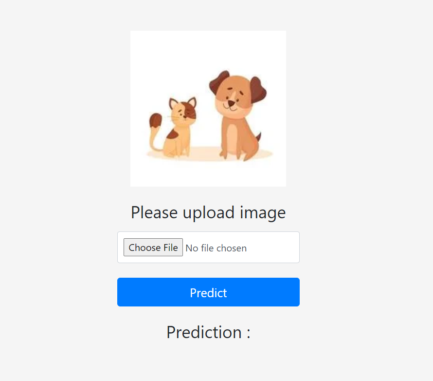

# Dogs-Vs-Cats

Dogs vs Cats was a competition that was organized by Kaggle on their platform in the year 2013.

# Problem Statement

In this competition, you'll write an algorithm to classify whether images contain either a dog or a cat. 
This is easy for humans, dogs, and cats. Your computer will find it a bit more difficult.

# The Asirra data set

Web services are often protected with a challenge that's supposed to be easy for people to solve, but difficult for computers. Such a challenge is often called a 
CAPTCHA (Completely Automated Public Turing test to tell Computers and Humans Apart) or HIP (Human Interactive Proof). 
HIPs are used for many purposes, such as to reduce email and blog spam and prevent brute-force attacks on web site passwords.

Dataset link : https://www.kaggle.com/c/dogs-vs-cats/data

If you find this notebook useful, Show your appreciation with an upvote here > https://www.kaggle.com/abhaymudgal/dogs-vs-cats

# Deploy

This application is currently deployed on Heroku.
Url - https://hey-siri-is-it-a-cat-or-dog.herokuapp.com/

